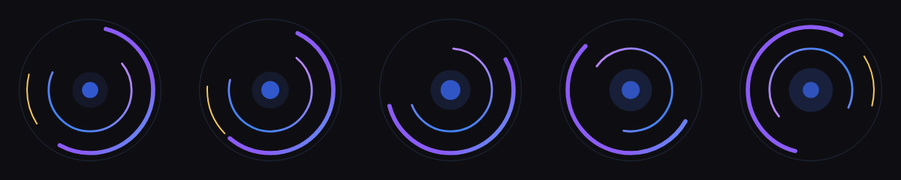
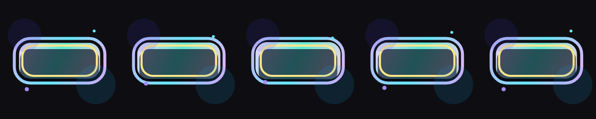
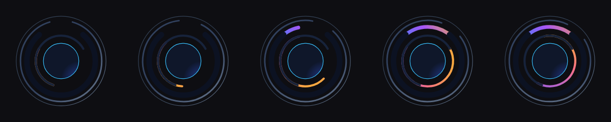
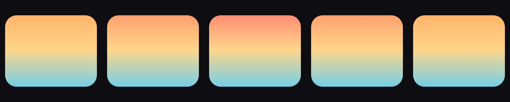
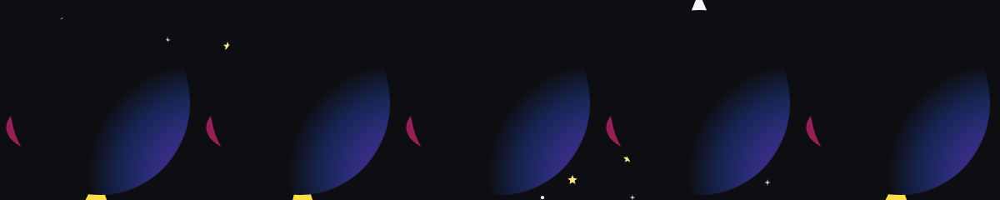

# Showcase Gallery

Ten reference animations in two tiers.

The six **basics** were each authored end to end by an AI agent with fresh context, equipped with nothing
but [`skills/rive-animation/SKILL.md`](../skills/rive-animation/SKILL.md) and the `rive-cli` binary — no
agent read the Rust source, the test fixtures, or any other scene here.

The four **advanced** scenes were authored later, against the same measured bar, to demonstrate
capabilities the basics cannot reach: embedded fonts, path morphing, embedded imagery, and pointer-driven
state machines. They were authored with repository knowledge rather than fresh context.

They exist to prove two things: that the CLI exposes enough of the Rive format for real motion-design work,
and that the author can *verify its own output* — every scene below cleared a measured gate (compiles,
validates, loads in the real Rive WASM runtime, renders non-blank, and animates).

Each contact sheet below is frames 0/15/30/45/60 at 240x240, produced by `rive-cli render --contact-sheet`.

| Scene | Size | Animations | State machines | Peak colours |
|---|---:|---:|---:|---:|
| [Orbital Loader](#orbital-loader) | 1,688 B | 1 | 0 | 1,596 |
| [Interactive Pulse Button](#pulse-button) | 4,041 B | 3 | 1 | 3,416 |
| [Radial Dashboard Gauge](#radial-dashboard) | 2,400 B | 1 | 0 | 2,560 |
| [Audio Equaliser](#audio-equaliser) | 2,040 B | 1 | 0 | 2,845 |
| [Day / Night Toggle](#day-night-toggle) | 4,525 B | 2 | 1 | 484 |
| [Rocket Launch](#rocket-launch) | 3,505 B | 1 | 0 | 686 |

Advanced tier:

| Scene | Capability | Animations | State machines | Peak colours |
|---|---|---:|---:|---:|
| [Wordmark](#wordmark) | embedded font | 1 | 0 | 4,969 |
| [Liquid Loader](#liquid-loader) | path morphing | 1 | 0 | 2,953 |
| [Textured Scene](#textured-scene) | embedded PNG | 1 | 0 | 33,616 |
| [Control Panel](#control-panel) | pointer + blend state | 5 | 1 | 4,597 |

## Reproducing

The `.riv` files are committed and are byte-for-byte reproducible from their specs
(`test_showcase_riv_files_are_up_to_date` in `tests/e2e.rs` enforces this):

```bash
rive-cli generate showcase/orbital_loader.json -o showcase/orbital_loader.riv
rive-cli validate showcase/orbital_loader.riv
rive-cli render   showcase/orbital_loader.riv --frames 0,15,30,45,60 \
  --width 240 --height 240 --scale 1 --background '#0E0E12' --contact-sheet --preview -o frames/
```

`--preview` prints an ASCII coverage map, the dominant colour percentage and the content bounding box —
this is how an agent inspects a render without a vision model.

## Regression coverage

Every scene here is guarded by three layers: `generate` + `validate` in `tests/e2e.rs`, a real-runtime load
in `tests/playwright/regression.js`, and pixel baselines at frames 0/30/60 in
`tests/playwright/visual-regression.js`.

## The scenes

### Orbital Loader
<a id="orbital-loader"></a>



Indeterminate loading spinner: concentric rings, a gradient-stroked arc sweeping via trim path, a counter-rotating inner ring and an eased core pulse. Seamless loop.

`showcase/orbital_loader.json` &rarr; `showcase/orbital_loader.riv` (1,688 bytes) &middot; animations: `orbital_loop` &middot; peak distinct colours: 1,596

### Interactive Pulse Button
<a id="pulse-button"></a>



State-machine button with `isHovered` (bool) and `press` (trigger) inputs. Distinct resting, hovered and pressed looks with a gradient body, glow ring and ripple.

`showcase/pulse_button.json` &rarr; `showcase/pulse_button.riv` (4,041 bytes) &middot; animations: `rest`, `hovered`, `pressed` · state machines: `PulseButtonMachine` &middot; peak distinct colours: 3,416

```bash
rive-cli render showcase/pulse_button.riv --state-machine 'PulseButtonMachine' \
  --frames 0,20,40 --preview -o frames/
```

### Radial Dashboard Gauge
<a id="radial-dashboard"></a>



Data-visualisation gauge: a radial progress arc filling via trim path, a tick ring, a counter-rotating secondary arc and a scaling centre indicator.

`showcase/radial_dashboard.json` &rarr; `showcase/radial_dashboard.riv` (2,400 bytes) &middot; animations: `dashboard_pulse` &middot; peak distinct colours: 2,560

### Audio Equaliser
<a id="audio-equaliser"></a>


Seven spectrum bars with per-bar phase offsets and cubic easing, cool-to-warm gradient palette. Seamless loop.

`showcase/audio_equaliser.json` &rarr; `showcase/audio_equaliser.riv` (2,040 bytes) &middot; animations: `spectrum_loop` &middot; peak distinct colours: 2,845

### Day / Night Toggle
<a id="day-night-toggle"></a>



Pill toggle animating between a warm day scene and a deep-blue night scene, driven by the `isNight` bool input. The knob slides and the palette shifts.

`showcase/day_night_toggle.json` &rarr; `showcase/day_night_toggle.riv` (4,525 bytes) &middot; animations: `day`, `night` · state machines: `DayNightMachine` &middot; peak distinct colours: 484

```bash
rive-cli render showcase/day_night_toggle.riv --state-machine 'DayNightMachine' \
  --frames 0,20,40 --preview -o frames/
```

### Rocket Launch
<a id="rocket-launch"></a>



Vector rocket accelerating upward with an eased climb, a flickering flame and stars drifting downward to imply speed.

`showcase/rocket_launch.json` &rarr; `showcase/rocket_launch.riv` (3,505 bytes) &middot; animations: `launch` &middot; peak distinct colours: 686

## The advanced scenes

Each one carries a capability proof: the same scene with the capability removed, rendered side by side.

### Wordmark
<a id="wordmark"></a>

__omp_shell("[Wordmark](previews/wordmark.png)")

Animated logotype set in an **embedded font** (`assets/fonts/Inter-Bold-Subset.ttf`, SIL OFL). The word and
its tagline arrive on staggered beats with an eased overshoot, a gradient underline sweeps in via trim path,
and an orbiting mark rotates through the loop.

`showcase/wordmark.json` &rarr; `showcase/wordmark.riv` &middot; animations: `wordmark` &middot; peak
distinct colours: 4,969

Capability proof — the two text objects alone, with and without the embedded font:

```
with font:    frame 140  479 distinct colours
without font: frame 140    1 distinct colour   BLANK
```

### Liquid Loader
<a id="liquid-loader"></a>

__omp_shell("[Liquid Loader](previews/liquid_loader.png)")

A blob whose **outline itself deforms**: the six `cubic_detached_vertex` control points of a closed
`points_path` are keyframed in x, y and handle length, so the silhouette morphs rather than merely
transforming. A trim-path halo and an orbiting satellite sit inside it.

`showcase/liquid_loader.json` &rarr; `showcase/liquid_loader.riv` &middot; animations: `liquid` &middot;
peak distinct colours: 2,953

Capability proof — the blob alone, with every other element removed, still changes its bounding box:

```
frame  0  (256, 238)..(767, 785)
frame 30  (280, 222)..(743, 801)
frame 60  (289, 195)..(734, 828)
```

### Textured Scene
<a id="textured-scene"></a>

__omp_shell("[Textured Scene](previews/textured_scene.png)")

An illustrated vignette combining an **embedded PNG** (`assets/textures/aurora.png`) with hand-authored
bezier ridge lines, a radial sun halo, a dashed light arc and a drifting mist gradient. The layers parallax
against each other across a four-second loop.

`showcase/textured_scene.json` &rarr; `showcase/textured_scene.riv` &middot; animations: `scene` &middot;
peak distinct colours: 33,616

Capability proof — the same scene with the image asset removed:

```
with image:    frame 120  29,128 distinct colours
without image: frame 120   5,469 distinct colours
```

### Control Panel
<a id="control-panel"></a>

__omp_shell("[Control Panel](previews/control_panel.png)")

An interactive surface: a button that responds to a **real pointer event** through a Rive listener, and a
dial arc driven by a **1D blend state** reading the `level` number input. A third layer keeps an ambient
indicator sweeping so the panel is alive before anything is touched.

`showcase/control_panel.json` &rarr; `showcase/control_panel.riv` &middot; animations: `level_low`,
`level_high`, `button_idle`, `button_pressed`, `ambient` &middot; state machines: `Panel` &middot; peak
distinct colours: 4,597

```bash
rive-cli render showcase/control_panel.riv --state-machine Panel \
  --pointer down:300,452@10 --input level=70 --frames 0,9,20,40,60 --preview -o frames/
```

Capability proofs, all measured:

- frames 0 and 9 are byte-identical with and without `--pointer down:300,452@10`; frames 20, 40 and 60 differ
- the same pointer sequence renders byte-identically on repeat
- `--pointer down:60,60@10`, outside the hit target, matches the untouched run exactly
- `--input level=` sweeps the dial continuously: 0 &rarr; 2,181 colours, 25 &rarr; 3,018, 50 &rarr; 4,066,
  75 &rarr; 4,482, 100 &rarr; 4,596

The Playwright layers load this scene without driving it, so they guard its idle appearance only. The
pointer and blend behaviour is guarded by `test_pointer_and_scheduled_input_change_the_render` in
`tests/e2e.rs` and by the commands above.
